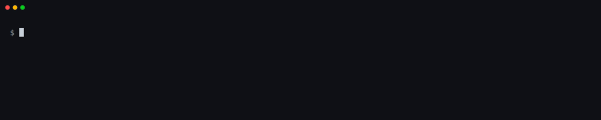

# Local commands (no account, no API key)

The commands below run fully client-side. They do not require a CRA Evidence
account or an API key, and the `check`-family commands never contact CRA Evidence.
They use the network for vulnerability data and public datasets.

Back to the [README](../README.md).

Global options such as `--output` and `--verbose` precede the subcommand:
`craevidence --output json <subcommand> ...`. The `check` command additionally
accepts `--output` directly as its own option, overriding the group-level value
for that run; all other commands in this page use only the group-level form.

## `check`

Run a no-key local security snapshot. This command does not require
`CRA_EVIDENCE_API_KEY`, does not call the CRA Evidence API, and does not build
the API client.

```
craevidence check [PATH]
  [--image <image-ref>]
  [--sbom <sbom.json>]
  [--baseline <previous-check.json>]
  [--fail-on critical|high|medium|known-exploited]   # gate on absolute severity / KEV
  [--fail-on-new critical|high|medium|any]           # with --baseline: gate only on NEW vulns
  [--deny-license <SPDX,SPDX,...>]                   # exit 16 if a component carries a denied license
  [--sbom-quality]                                   # add a BSI TR-03183-2 (sbomqs) quality dimension
  [--fail-on-score <0-100>]                          # exit 14 if the sbomqs score is below N
  [--vex <openvex-or-csaf.json>]                     # suppress not_affected/fixed findings before gates
  [--policy-file <.cra/check.yaml>]                  # committed defaults (auto-loaded from .cra/check.yaml)
  [--annotations github|gitlab|auto]                 # emit PR/MR inline annotations (output only)
  [--annotations-file <path>]                        # GitLab Code Quality report path (default gl-code-quality-report.json)
  [--sbom-output <path>]                             # also save the generated SBOM as a CI artifact
  [--strict]
  [--output text|json|sarif|markdown]
  [--output-file, -o <path>]                         # write the machine report to a file (summary stays on stdout)
  [--json-output <path>]                             # also write the JSON report (any --output)
  [--sarif-output <path>]                            # also write the SARIF report (any --output)
  [--markdown-output <path>]                         # also write the Markdown report (any --output)
```

Notes:
- `--fail-on-new` is the brownfield ratchet: it fails only on vulnerabilities introduced
  since `--baseline` (a previous `--output json` report), so a backlog of known issues does
  not block every build.
- `--deny-license` reads the per-component licenses already parsed from the SBOM, e.g.
  `--deny-license AGPL-3.0-only,GPL-3.0-only`.
- `--sbom-quality` / `--fail-on-score` require the optional `sbomqs` binary on `PATH`; if it
  is not installed the dimension is skipped (reported as `unavailable`, never a silent pass).
- Each finding's exploit probability is shown inline when available and used to
  rank the "Top actions".
- `--vex` consumes an [OpenVEX](https://openvex.dev/) (or CSAF VEX) document and suppresses a
  finding **before** the gates only when a matching statement is `fixed`, or `not_affected` with
  a justification or impact statement (a `not_affected` statement with no rationale never
  suppresses). Product-scoped statements match on purl precisely (a versionless product purl
  matches any version of the same package; a versioned one matches that version only). Every
  suppression is recorded in the JSON/SARIF output and counted in the text summary, and a
  known-exploited (KEV) finding suppressed by VEX is always surfaced, never silently hidden.
- `--policy-file` supplies committed defaults for `fail-on`, `fail-on-new`, `deny-license`,
  `vex`, `sbom-quality`, `fail-on-score`, and an `ignore` list of CVE ids. It is auto-loaded
  from `.cra/check.yaml` when present. Explicit CLI flags always override the file. An `ignore`d
  CVE is still shown (marked "ignored by policy") and excluded only from the gates, never dropped.
  Schema:
  ```yaml
  # .cra/check.yaml
  fail_on: high                 # critical | high | medium | known-exploited
  fail_on_new: any              # critical | high | medium | any
  deny_license:                 # SPDX ids (a bare string is accepted too)
    - AGPL-3.0-only
  vex: security/openvex.json    # path to a VEX document
  sbom_quality: true            # add the sbomqs dimension
  fail_on_score: 70             # 0-100
  ignore:                       # CVE ids: shown but not gated
    - CVE-2021-44228
  ```
- `--annotations` is output formatting only: it never changes the exit code or introduces a
  compliance verdict, and it composes with `--output`/`--output-file`. `github` emits
  `::warning`/`::error` workflow commands and appends a summary table to `$GITHUB_STEP_SUMMARY`
  when set; `gitlab` writes a Code Quality JSON report (path via `--annotations-file`); `auto`
  detects the provider from the CI environment. A failed annotation write warns and is skipped,
  so it can never mask a vulnerability gate.
- `--sbom-output` writes a copy of the generated SBOM to the given path (handy as a CI
  artifact). It is a no-op (with a message) when you supplied the SBOM yourself via `--sbom`.
- `--json-output`, `--sarif-output`, and `--markdown-output` each write that format to a path
  regardless of `--output`, so a single scan can produce several files in one pass (for example
  SARIF for code scanning plus JSON for archival) instead of re-running the check per format.
  They are written before any gate runs, so a failing gate still leaves the artifacts on disk,
  and missing parent directories are created.
- `--output` accepts `text`, `json`, `sarif`, or `markdown`. It may be given at the group level
  (`craevidence --output json check ...`) or after the subcommand (`craevidence check --output
  json ...`); the subcommand-level value takes precedence when both are given.
- Gate exit codes: `--fail-on critical` exits 10; `--fail-on high` exits 11; `--fail-on medium`
  exits 12; `--fail-on known-exploited` exits 17. `--fail-on-score` exits 14 when the sbomqs
  score is below the threshold. `--strict` exits 15 when a required data source is stale or
  unavailable. `--deny-license` exits 16 when a denied license is detected.
- When a local vulnerability engine is absent or its scan fails, the command falls back to
  querying OSV.dev over the network. When an installed engine fails, a notice goes to stderr:
  `Local matcher failed (<reason>); querying OSV.dev over the network instead.` The OSV.dev
  path reports real severities, CVE aliases, fixed versions, and supports all `--fail-on` gates
  identically to the local engine path.
- Pointing `check` at a directory that contains no recognised dependency manifests exits 1 with
  an explanatory message listing the manifest types it looks for (for example `requirements.txt`,
  `poetry.lock`, `package-lock.json`, `go.mod`, `pom.xml`, `Cargo.lock`, `Gemfile.lock`).
  A genuinely malformed file passed via `--sbom` exits 1 with `Unsupported SBOM format`.

The result is a local snapshot, not a compliance verdict. `exit 0` means no
blocking findings were found under the selected local gate.

Run it in CI with no account. The published GitHub Action and GitLab component
expose a no-key `check` mode:

```yaml
# GitHub Actions - no api-key needed
- uses: craevidence/cli@v3
  with:
    command: check
    path: .
    fail-on: known-exploited      # optional CI gate
- uses: github/codeql-action/upload-sarif@v3
  with:
    sarif_file: craevidence.sarif
```

```yaml
# GitLab CI - no API key needed
include:
  - component: $CI_SERVER_FQDN/craevidence/cli/cra-evidence@v3
cra-check:
  extends: .cra-evidence-check
  variables:
    CRA_CHECK_PATH: "."
    CRA_CHECK_FAIL_ON: "known-exploited"
```

## `db update`

Bootstrap or refresh the local Grype vulnerability database into a CLI-managed
cache. No API key is required.

```
craevidence db update [--cache-dir <dir>]
```

- The cache directory resolves to `--cache-dir`, else `$GRYPE_DB_CACHE_DIR`, else
  `~/.cache/grype/db`. On success the command prints the resolved cache path and the
  database build date.
- Requires Grype on `PATH`; if it is missing the command exits 15 with install guidance.
- Concurrent runs are serialized with a file lock, so parallel CI jobs sharing a cache
  do not race on the download.

Typical flow:

```bash
craevidence db update                       # populate / refresh the cache (network)
craevidence db status                       # inspect local cache (no network)
```

## `db status`

Inspect the local Grype vulnerability database cache without a network call.
No API key is required.

```
craevidence db status [--cache-dir <dir>]
```

It reports the resolved cache path, whether Grype is installed, whether a local
`vulnerability.db` is present, the DB build date from local metadata when
available, the schema version, the local DB mtime date, and whether the cache
appears stale.

## `draft`

Generate skeleton compliance documents locally. No `CRA_EVIDENCE_API_KEY` is
required. Every output is a draft to review and complete before use.

### `draft vex`

Produce a VEX skeleton from the local scan findings, one statement per finding
with status `under_investigation`, for you to triage. Emits
[OpenVEX](https://openvex.dev/) by default or CSAF 2.0 VEX with `--format csaf`.

```
craevidence draft vex [PATH]
  [--image <image-ref>]
  [--sbom <sbom.json>]
  [--format openvex|csaf]   # default: openvex
  [--output-file, -o <out.vex.json>]
```

- It runs the same finding pipeline as `check` (Grype when installed and
  working, with OSV.dev as the fallback when it is absent or fails), then emits one statement per finding. The status is always
  `under_investigation`; it never pre-fills `not_affected` or `fixed`, so the
  tool never asserts non-exploitability on your behalf.
- `--format csaf` emits a CSAF 2.0 VEX document instead. We already consume CSAF
  VEX in `check --vex`, so the CSAF skeleton round-trips through the same path.
- Fill in a real `justification` (or `impact_statement`) and set the status,
  then feed the file back into `craevidence check --vex <file>`. The round-trip
  is exact: only `fixed`, or `not_affected` with a rationale, suppress a finding.

### `draft advisory`

Produce a CSAF 2.0 security advisory skeleton from the local scan findings, one
vulnerability entry per finding, for you to complete and publish through your own
process.

```
craevidence draft advisory [PATH]
  [--image <image-ref>]
  [--sbom <sbom.json>]
  [--output-file, -o <advisory.json>]
```

- It runs the same finding pipeline as `check` (Grype when installed and
  working, with OSV.dev as the fallback when it is absent or fails), then emits a draft CSAF 2.0 advisory (`document.category`
  `csaf_security_advisory`). Each entry carries placeholder `notes`, a
  `vendor_fix` remediation, and a `product_status` referencing the affected
  component, for you to fill in.
- This is a **draft skeleton only**. It does not publish, sign, distribute, or
  time-stamp an advisory. Review and complete every entry before use.

### `draft security.txt`

Emit an [RFC 9116](https://www.rfc-editor.org/rfc/rfc9116) `security.txt`
template, or validate an existing one.

```
craevidence draft security.txt [--output-file, -o <path>]
craevidence draft security.txt --validate <path>|- [--fail-on-invalid]
```

- Without `--validate` it prints a `security.txt` template with placeholder
  values. Edit `Contact`, `Policy`, and `Canonical` before publishing to
  `/.well-known/security.txt`. The file is watermarked as a draft.
- `--validate <path>` (or `-` for stdin) checks an existing file instead.
  Errors (RFC 9116 MUST violations): a missing or non-URI `Contact`, a web
  `Contact` not using `https`, and a missing, duplicate, or non-RFC-3339
  `Expires`, or an already expired `Expires`. Warnings: a soon-to-expire
  `Expires` (within 30 days) and any leftover placeholder values. Validation is advisory and exits 0; pass
  `--fail-on-invalid` to exit 7 when it finds errors.

### `draft risk-assessment` and `draft threat-model`

Scaffold compliance YAML seeded from your SBOM components. Neither needs an API
key or contacts CRA Evidence. `draft
threat-model` makes no network call; `draft risk-assessment` runs a local
vulnerability scan that by default uses the network for vulnerability data.

```
craevidence draft risk-assessment [PATH] [--sbom <sbom.json>] [--template <id>] [--product <name>] [--org <name>] [-o <out.yaml>]
craevidence draft threat-model    [PATH] [--sbom <sbom.json>] [--diagram <arch.mmd>] [--product <name>] [--org <name>] [-o <out.yaml>]
```

- They parse an SBOM (from `--sbom`, an SBOM file path, or one generated from a
  directory) and pre-fill risk/threat subjects from the real component names.
  `draft risk-assessment` also uses the local finding pipeline to seed starter
  vulnerability risks with the detected CVE severity when scan data is available.
- `draft threat-model --diagram <arch.mmd>` instead reads your existing Mermaid
  architecture diagram and seeds **one threat per data flow**: components become
  capabilities, subgraphs become trust-boundary groups, and boundary-crossing
  flows come first. Each threat is a bracketed STRIDE prompt you complete. No
  `mmdc` or network is needed; it is a plain text parse.
- These are deterministic **starter drafts, not reasoned assessments**: the tool
  has no model and cannot judge your risks or threats for you. Bracketed
  placeholders mark what you must complete.
- They emit the same compliance YAML as `compliance-as-code template`, so a
  draft can be validated and uploaded through that path.

## `eol-check`


Flag SBOM components whose version is past end-of-life, using the public
[endoflife.date](https://endoflife.date) dataset. No API key. Advisory only:
it never gates a pipeline (it always exits 0 on success), and **being past
end-of-life is not the same as being vulnerable**.

```
craevidence [--output text|json|sarif] eol-check [PATH]
  [--sbom <sbom.json>]
  [-o <path>]
```

`markdown` is not supported; passing `--output markdown` prints a notice to stderr and falls
back to `text`.

- It parses an SBOM (from `--sbom`, an SBOM file path, or one generated from a
  directory) and looks up each component name against endoflife.date. Matching
  is exact on the product slug to keep false positives low.
- Most components are not tracked by endoflife.date. Those are counted as having
  no endoflife.date data and are **not** evaluated; a clean result means "no
  end-of-life among the products endoflife.date recognizes", not "no end-of-life
  software".
- Beyond end-of-life, it reports each recognized component's **support status**
  (active support / security-only / unknown / past EOL) from the endoflife.date
  `support`/`eoas`/`lts` fields. Upstream dependency EOL can be one input when
  reviewing product support periods. This report does not produce or verify the
  manufacturer's published support commitment. Verify against the vendor's
  stated support dates.

## `egress-check`

Inventory the remote-data-processing indicators in your product: known
telemetry, analytics, error-reporting, and cloud SDKs in the SBOM, plus
hard-coded external URLs in your source. **100% local, no network, no API key.**
Advisory only: it never gates (always exits 0 on success), and it never claims
that personal data is processed or that anything is unlawful.

```
craevidence [--output text|json|sarif] egress-check [PATH]
  [--sbom <sbom.json>]
  [-o <path>]
```

- Layers 1 and 2 read the SBOM (from `--sbom`, an SBOM file path, or one
  generated from a directory) and match component names against an in-repo,
  non-exhaustive catalog of data-collecting SDKs and network-capable libraries.
- Layer 3 runs only when you pass a project **directory**: it walks source files
  for external URLs (loopback, `.local`, and documentation hosts are excluded)
  and lists them as **candidates to review** (this layer can be noisy).
- Use the results to review external interfaces and data flows. This tool cannot
  evidence encryption, data minimisation, personal-data processing, or lawful
  processing.

## `secrets-check`

Scan the working tree **and git history** for hard-coded credentials. **100%
local, no network, no API key.** Advisory by default (it exits 0 even when
matches are found); pass `--fail-on-match` to gate a CI job (exit code 18).

```
craevidence [--output text|json|sarif] secrets-check [PATH]
  [--no-git-history]
  [--fail-on-match]
  [-o <path>]
```

`markdown` is not supported; passing `--output markdown` prints a notice to stderr and falls
back to `text`.

- It looks for high-confidence provider patterns (AWS, GitHub, Slack, Google,
  Stripe, private-key blocks, JWTs) plus high-entropy values assigned to
  secret-like names. Obvious placeholders and templated values (`${VAR}`,
  `your_...`) are filtered to keep noise down.
- When the path is a git repository it also scans commit history, because a
  secret removed from the latest commit can still be recovered from history and
  **must be rotated, not just deleted**. Use `--no-git-history` to skip this.
- Matches are **candidate patterns only**: it never contacts a network to verify
  a secret is live, and a clean run does not prove the absence of secrets.
  Matched values are redacted; the raw secret is never printed or written.
- Use the results to review vulnerability exposure and protection of sensitive
  data.

## `config-check`


Audit Dockerfiles, Terraform, and Kubernetes/Compose manifests for a curated set
of insecure-default and attack-surface patterns. **100% local, no network, no
API key.** Advisory by default (it exits 0 even when findings are reported); pass
`--fail-on-match` to gate a CI job (exit code 19).

```
craevidence [--output text|json|sarif] config-check [PATH]
  [--fail-on-match]
  [-o <path>]
```

`markdown` is not supported; passing `--output markdown` prints a notice to stderr and falls
back to `text`.

- It checks for things like containers running as root (no `USER`, or `USER
  root`), `privileged`/`hostNetwork` pods, `allowPrivilegeEscalation`, broad Linux
  capabilities, binding to `0.0.0.0`, world-open ingress (`0.0.0.0/0`), and public
  storage ACLs.
- It is **deliberately narrow and not a Checkov/KICS/hadolint replacement**: use
  those for full coverage. Findings are **candidates to review**, not a
  determination, and a clean result does not prove a secure-by-default
  configuration.
- Use the results to review secure defaults and attack-surface exposure. Static
  scanning cannot observe every runtime or organisational control.

## `compliance-as-code template --offline`



Scaffold starter compliance YAML with `compliance-as-code template`. By default it
pre-fills real product, org, and SBOM-component data from your account; add
`--offline` (with `--product`/`--org`) to generate locally with no API key and
no network. Add `--sbom <sbom.json>` with `--offline` to seed RiskCatalog or
ThreatCatalog subjects from local components; without `--sbom`, offline output
uses placeholders you must replace. Install `cue` for local validation.

## `assessment`

Scaffold and gate a local CRA Annex I applicability assessment. No account or API
key, no network. The matrix and catalogs are starters you complete; the gate
checks structured gaps only, so it is **not an audit and exit 0 does not prove
compliance**.

```
# List the bundled product-type templates
craevidence assessment templates

# Scaffold from a template (multi-select runs in a terminal; recommended items pre-checked)
craevidence assessment new --template consumer-iot --product "My Camera"

# Lint the matrix and gate CI
craevidence assessment check
```

`assessment new` writes three files into `.cra/` (configurable with
`--output-dir`) and never overwrites an existing file:

- `assessment.yaml` - the applicability matrix: one row per canonical Annex I
  requirement (Part I(1), the thirteen Part I(2) letters, the eight Part II
  duties), with its applicability, implementation status, and any justification.
- `risk-catalog.yaml` and `control-catalog.yaml` - Gemara starters seeded from the
  risks and controls you select, in the same shape as `compliance-as-code template`.

Pass `--non-interactive` (or run in CI) to keep the recommended items without a
prompt. With no `--template`, the product type is auto-detected from build and
manifest files in the path; it only suggests, and asks you to pass `--template`
when the signal is unclear.

`assessment check` lints the matrix and exits non-zero on:

- **exit 25** - a mandatory requirement (Part I(1) or any Part II duty) is absent,
  marked not-applicable, or applicable with no implementation recorded.
- **exit 26** - a Part I(2) requirement is marked not-applicable with no
  justification (CRA Article 13(4) requires a clear justification).

Two optional committed files tune the gate, both auto-discovered in `.cra/`:

- `assessment-gate.yaml` - `fail_on` selects which conditions block
  (`missing_mandatory`, `unjustified_waiver`); others are reported but advisory.
  It can also set the `matrix` and `exceptions` paths.
- `assessment-exceptions.yaml` - per-requirement justifications. An entry can
  justify a Part I(2) not-applicable decision, or record that a mandatory duty is
  `addressed_elsewhere`, without editing the generated matrix. A mandatory
  requirement can never be marked not-applicable, in the matrix or here.

`--template`, `--matrix`, `--config`, and `--exceptions` override the defaults.
You can also seed a product-type risk set into the existing scaffold with
`craevidence draft risk-assessment --template <id>` or
`craevidence compliance-as-code template --type risk-catalog --template <id>`.

`assessment templates` and `assessment check` support `--output text` and `--output json` (via
the group-level `--output`). `sarif` and `markdown` are not supported; passing either prints a
notice to stderr and falls back to `text`.

## `version`

Show the CLI version.

```
craevidence version
```
